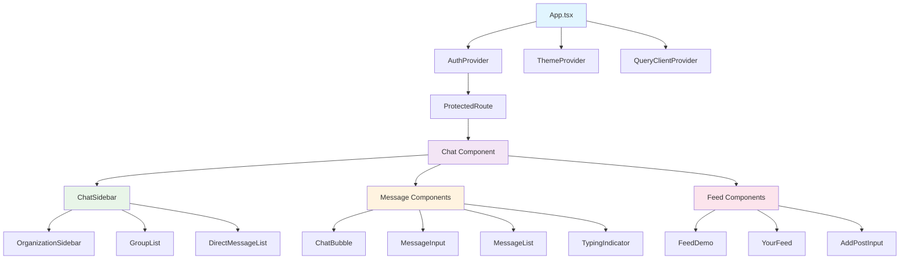
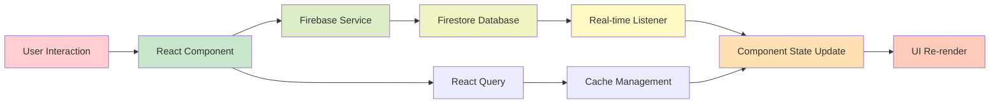

# Hash8 Chatter Project Analysis

## Overview

Hash8 Chatter is a modern, organization-oriented intranet platform designed for real-time group chat, direct messaging, and a social feed. Built with React, TypeScript, and Firebase, it provides a centralized communication hub for organizations, enhancing collaboration and engagement through real-time messaging, post sharing, and robust moderation capabilities.

## Technology Stack & Dependencies

### Frontend Framework
- **React** v18.3.1 - Component-based architecture with hooks and functional components
- **TypeScript** v5.5.3 - Type safety and enhanced developer experience
- **Vite** v5.4.1 - Fast development server and build tool with hot module replacement

### UI Framework & Styling
- **shadcn/ui** - Component library built on Radix UI primitives
- **Tailwind CSS** v3.4.11 - Utility-first CSS framework
- **Radix UI** - Accessible component primitives (Accordion, Dialog, Dropdown, etc.)
- **Framer Motion** - Animation library for smooth transitions
- **Lucide React** - Modern icon library

### Backend Services
- **Firebase SDK** v12.0.0
  - Firebase Auth - Google and email/password authentication
  - Firestore - Real-time NoSQL database with offline persistence
  - Firebase Storage - File and image upload capabilities
- **Cloudinary** - Image processing and CDN

### State Management & Data Fetching
- **React Context API** - Global state management for auth and theme
- **React Query** v5.56.2 - Server state management, caching, and data synchronization
- **React Hook Form** v7.53.1 - Form state management with validation

### Testing & Development Tools
- **Vitest** v3.2.4 - Unit testing framework
- **Testing Library** - Component testing utilities
- **ESLint** - Code linting and formatting
- **TypeScript ESLint** - TypeScript-specific linting rules

## Architecture

### Component Architecture



### Data Flow Architecture



### Routing Structure

| Route | Component | Protection | Description |
|-------|-----------|------------|-------------|
| `/` | Navigate to `/chat` | None | Root redirect |
| `/login` | Login | Public only | Authentication page |
| `/chat` | Chat | Protected | Main chat interface |
| `*` | NotFound | None | 404 fallback |

### Core Features Architecture

#### Authentication Flow
- Google OAuth and Email/Password registration
- Firebase Auth integration with user profile management
- Protected route wrapper for authenticated content
- Automatic profile creation in Firestore

#### Real-time Messaging
- Firestore real-time listeners for live message updates
- Typing indicators with debounced status updates
- Message read receipts and delivery status
- Offline persistence with IndexedDB

#### Organization Management
- Multi-organization support with role-based access
- Admin/Moderator/Member hierarchy
- Organization-specific groups and channels
- Invite system with email verification

#### Moderation System
- Role-based permissions (Admin, Moderator, Member)
- Message deletion with audit trail
- User promotion/demotion capabilities
- Moderation dashboard with action history

## Component Hierarchy

### UI Components (`src/components/ui/`)
- **Form Controls**: Button, Input, Textarea, Select, Checkbox, Radio Group
- **Layout**: Card, Separator, Accordion, Tabs, Sheet, Dialog
- **Feedback**: Toast, Alert Dialog, Progress, Skeleton
- **Navigation**: Dropdown Menu, Context Menu, Menubar, Pagination
- **Data Display**: Avatar, Badge, Table, Calendar, Carousel

### Business Components (`src/components/`)
- **Chat**: ChatBubble, MessageInput, MessageList, TypingIndicator
- **Direct Message**: DirectMessageHeader, MessageInput, MessageList
- **Moderation**: ModerationDashboard, MessageModerationMenu, MemberRoleActions
- **Social**: MessageReactions, MessageReadReceipts, EmojiPicker
- **Utility**: ErrorBoundary, ProtectedRoute, RoleBadge, VoiceRecorder

### Page Components (`src/pages/`)
- **Core**: Chat, Login, NotFound, Index
- **Chat Features**: ChatSidebar, DirectMessage, GroupInfoSheet
- **Organization**: OrganizationSettingsView, OrganizationSidebar
- **Social Feed**: FeedDemo, YourFeed, AddPostInput
- **Dialogs**: CreateGroupDialog, CreateOrganizationDialog, InviteToGroupDialog, JoinOrganizationDialog

## Data Models & Types

### User Management
```typescript
interface User {
  uid: string;
  name: string;
  email: string;
  avatar?: string;
  isOnline?: boolean;
  lastSeen?: Date;
  role?: UserRole; // 'admin' | 'moderator' | 'member'
  // Extended profile fields
  phone?: string;
  jobTitle?: string;
  department?: string;
  bio?: string;
  location?: string;
}
```

### Messaging System
```typescript
interface Message {
  id: string;
  groupId: string;
  senderId: string;
  senderName: string;
  senderAvatar?: string;
  text: string;
  timestamp: Date;
  type: 'text' | 'image' | 'file' | 'system';
  reactions?: Reaction[];
  isEdited?: boolean;
  readBy?: ReadReceipt[];
  // Moderation fields
  deleted?: boolean;
  deletedBy?: string;
  deletedAt?: Date;
  deletionReason?: string;
}
```

### Organization Structure
```typescript
interface Group {
  id: string;
  name: string;
  avatar?: string;
  members: string[]; // user IDs
  createdBy: string;
  createdAt: Date;
  lastMessage?: Message;
  unreadCount?: number;
}
```

## Firebase Integration

### Authentication
- `signInWithGoogle()` - Google OAuth authentication
- `signInWithEmail()` - Email/password login
- `registerWithEmail()` - User registration with profile creation
- `signOutUser()` - Session termination

### Firestore Collections
```
/organizations/{orgId}
  - name, admins, createdAt
  
/organization_memberships/{userId}_{orgId}
  - userId, organizationId, role, joinedAt
  
/organizations/{orgId}/groups/{groupId}
  - name, members, createdBy, createdAt
  
/organizations/{orgId}/groups/{groupId}/messages/{messageId}
  - senderId, text, timestamp, type, reactions, readBy
  
/users/{userId}
  - displayName, avatar, profile fields
  
/moderation_actions/{actionId}
  - actionType, targetId, moderatorId, reason, timestamp
```

### Real-time Subscriptions
- `subscribeToGroupMessages()` - Live message updates
- `subscribeToTypingIndicators()` - Real-time typing status
- `subscribeToUserStatus()` - Online/offline presence
- `subscribeToModerationActions()` - Audit trail monitoring

## State Management

### Context Providers
- **AuthContext** - User authentication state and methods
- **ThemeContext** - Light/dark theme toggle
- **QueryClientProvider** - React Query configuration

### Component State Patterns
- Local state for UI interactions (modals, forms, loading states)
- Real-time subscriptions for live data updates
- React Query for server state caching and synchronization
- Ref-based cleanup for subscription management

## Testing Strategy

### Unit Testing
- Component rendering and interaction tests
- Service function mocking and testing
- TypeScript type checking
- Form validation testing

### Test Configuration
- Vitest test runner with jsdom environment
- Testing Library for component testing
- Mock Firebase services for isolated testing
- Test setup configuration in `src/test/setup.ts`

## Development Environment

### Build & Development
```bash
npm run dev          # Development server (Vite)
npm run build        # Production build (TypeScript + Vite)
npm run test         # Run unit tests (Vitest)
npm run lint         # ESLint code checking
npm run preview      # Preview production build
```

### Firebase Deployment
```bash
npm run firebase:login    # Firebase authentication
npm run firebase:deploy   # Deploy Firestore rules
```

### Environment Configuration
- Firebase configuration via environment variables
- Vite environment variable handling
- TypeScript path aliases with `@/` prefix
- PWA configuration with offline support

## Security Considerations

### Authentication Security
- Firebase Auth handles secure token management
- Protected routes prevent unauthorized access
- User session validation on route changes

### Data Security
- Firestore security rules for data access control
- Role-based permissions for sensitive operations
- Input validation and sanitization
- XSS protection through React's built-in escaping

### Moderation & Content Control
- Audit trail for all moderation actions
- Permission-based access to moderation tools
- Content deletion with reason tracking
- User role management with proper authorization

## Performance Optimizations

### Frontend Performance
- Code splitting with dynamic imports
- Image optimization via Cloudinary
- Component memoization for expensive renders
- Virtual scrolling for large message lists
- Bundle size optimization with tree shaking

### Data Performance
- Firestore offline persistence with IndexedDB
- React Query caching for reduced API calls
- Real-time listener optimization
- Pagination for large datasets
- Debounced typing indicators

## Known Limitations & Technical Debt

### Current Limitations
- Limited to Firestore for database (no SQL support)
- No video/voice calling capabilities
- Basic file upload support (no drag-and-drop)
- No message threading or replies
- Limited search functionality

### Future Enhancement Opportunities
- Advanced search with full-text indexing
- Message threading and reply system
- Video/voice calling integration
- Advanced file sharing with previews
- Mobile app development
- Email notifications
- Advanced analytics and reporting